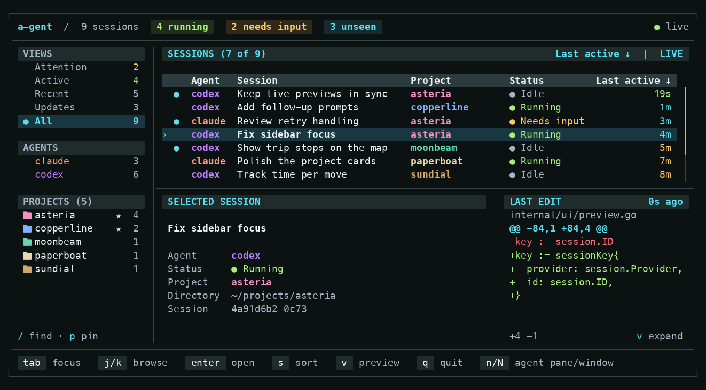

<h1 align="center">
  a-gent
</h1>

<p align="center">
  <a href="https://github.com/hexaquarks/a-gent/actions/workflows/tests.yml"></a>
  <a href="https://app.codecov.io/gh/hexaquarks/a-gent"></a>
  <a href="go.mod"></a>
</p>

a-gent is a small terminal dashboard for keeping track of Codex and Claude Code
sessions across projects. See which agents are working or waiting for you, preview
their activity and file edits, and jump to their tmux panes.

<p align="center">
  
</p>

## Install

Requires Go 1.24 or newer and Make:

```sh
git clone https://github.com/hexaquarks/a-gent.git
cd a-gent
make install
```

The binary is installed to `~/.local/bin`. Add that directory to your `PATH`, or
choose another destination with `make install BIN_DIR=/path/to/bin`.

## Supported adapters

- Codex: requires `codex` on your `PATH` and a running local app-server daemon.
- Claude Code: requires `claude` on your `PATH` with support for `claude agents --json`.

Sessions are discovered automatically from the local providers.

## Usage

```sh
a-gent
```

Inside tmux, the dashboard opens in a popup. Select a session and press Enter to
jump to its matching tmux pane. Outside tmux, it runs directly in your terminal.

- Press Tab to switch between the sidebar and sessions; use `j`/`k` or the arrow
  keys to browse.
- Use the sidebar to filter by project, provider, or session state. Press Enter
  to apply a filter.
- Press `/` to search projects and `p` to pin or unpin a project in the sidebar.
- Press `s` to change the sort column, `S` to reverse it, or `f` to hold the current
  order while sessions keep updating.
- Press `v` to expand the preview and Escape to return; press `q` to quit.

## Local development

Run directly from the checkout:

```sh
make run
```

## Tests

Run formatting checks, unit tests, and static analysis:

```sh
make check
```

Run the terminal integration tests with tmux installed:

```sh
make test-integration
```
